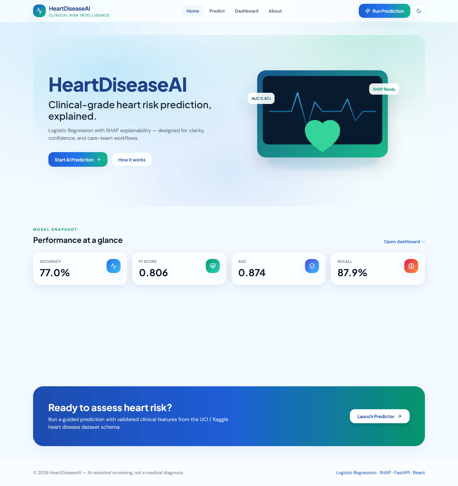
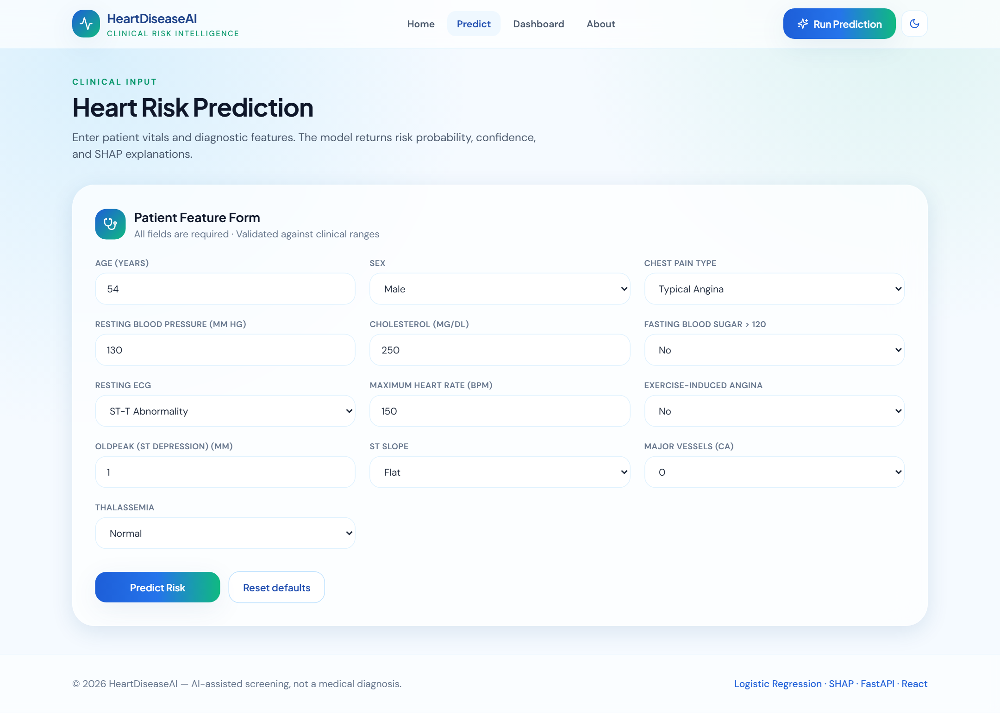
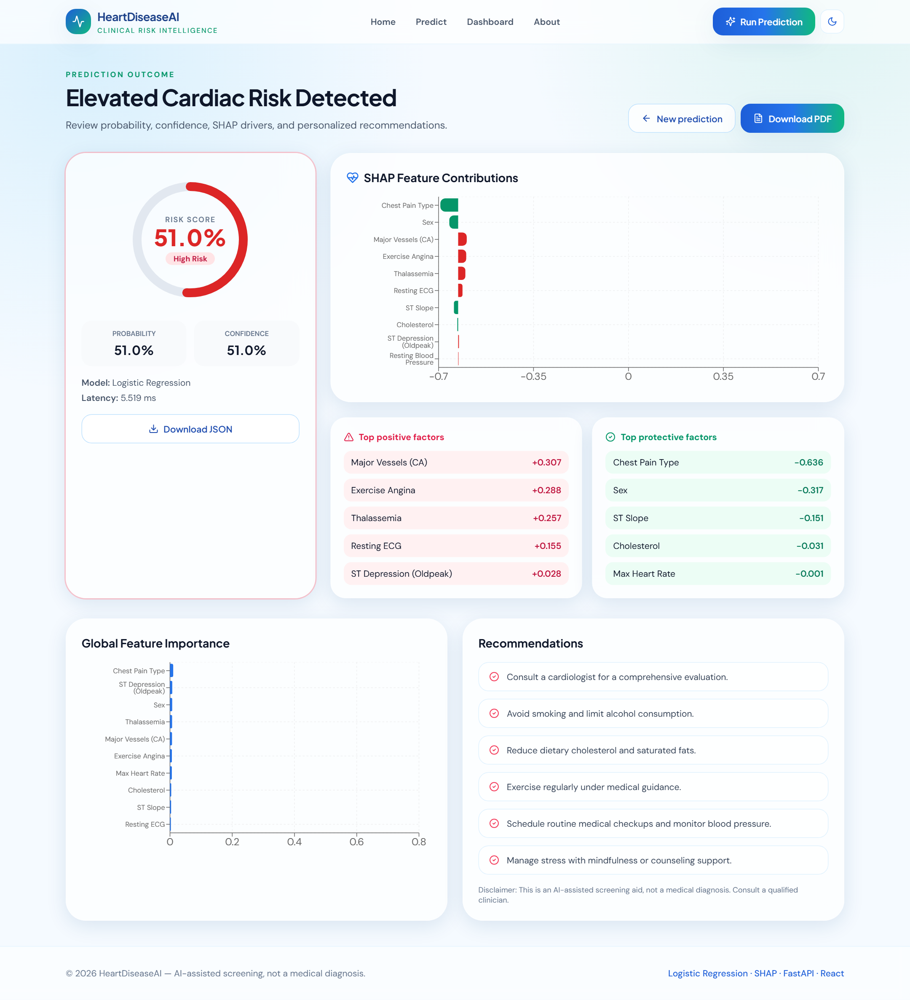
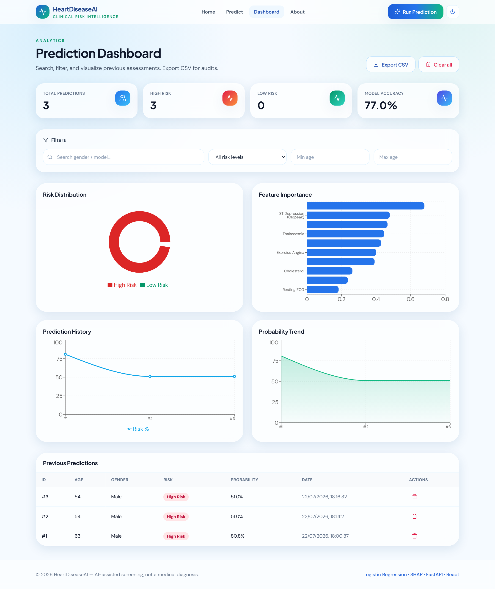
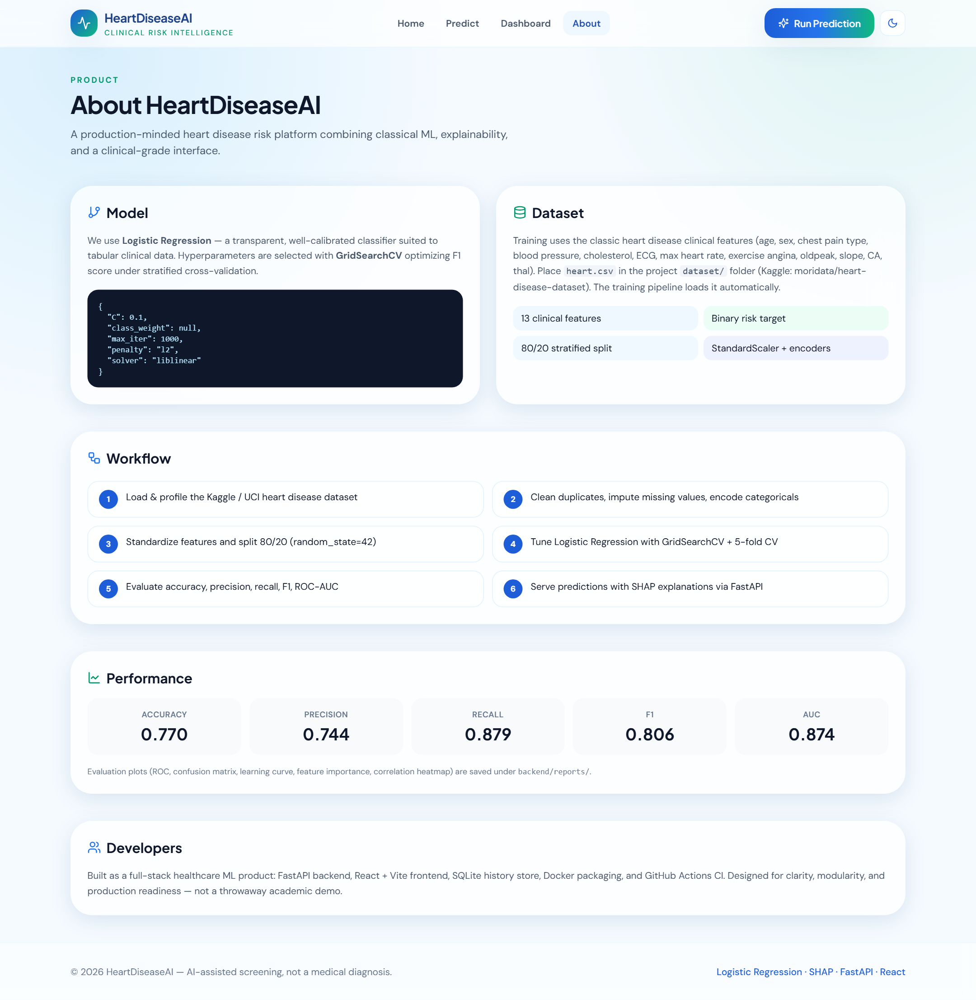

<div align="center">

# ❤️ HeartDiseaseAI

### Clinical-Grade Heart Disease Risk Prediction

**Logistic Regression · SHAP Explainability · FastAPI · React**

[](https://www.python.org/)
[](https://fastapi.tiangolo.com/)
[](https://react.dev/)
[](https://scikit-learn.org/)
[](LICENSE)

[Live Demo Setup](#-quick-start) · [Screenshots](#-screenshots) · [API Docs](#-api-overview) · [Architecture](#-architecture)

<br/>

A production-minded healthcare AI product — not a college demo.  
Predict cardiac risk, explain every decision with SHAP, and track history in a polished clinical dashboard.

</div>

---

## ✨ Highlights

| Capability | Detail |
|---|---|
| 🧠 **ML Model** | Tuned Logistic Regression (GridSearchCV + 5-fold CV) |
| 🔍 **Explainability** | Per-prediction SHAP drivers (positive & protective factors) |
| ⚡ **API** | FastAPI + Swagger, validation, logging, PDF reports |
| 📊 **Dashboard** | History, filters, pie/bar/line/area charts, CSV export |
| 🎨 **UI** | Glassmorphism, dark mode, Framer Motion, Recharts |
| 🐳 **Ops** | Docker, docker-compose, GitHub Actions CI |

---

## 📸 Screenshots

### Home
Brand-first hero, live model metrics, and clear CTAs.



### Predict
Guided clinical form with validated vitals and loading state.



### Result
Risk gauge, confidence, SHAP contributions, and recommendations + PDF download.



### Dashboard
Analytics cards, risk distribution, feature importance, trends, and searchable history.



### About
Model, dataset, workflow, and performance overview.



---

## 📈 Model Performance

| Metric | Score |
|--------|------:|
| Accuracy | **77.0%** |
| Precision | **0.744** |
| Recall | **0.879** |
| F1 Score | **0.806** |
| ROC-AUC | **0.874** |
| Best CV F1 | **0.851** |

Evaluation artifacts (ROC, confusion matrix, learning curve, correlation heatmap, feature importance) are saved under `backend/reports/`.

---

## 🏗 Architecture

```text
┌─────────────────┐      REST / JSON       ┌──────────────────────┐
│  React + Vite   │ ◄──────────────────► │  FastAPI Backend     │
│  Tailwind UI    │                       │  Logistic Regression │
│  Recharts       │                       │  SHAP + SQLite       │
└─────────────────┘                       └──────────┬───────────┘
                                                     │
                                          ┌──────────▼───────────┐
                                          │  dataset/heart.csv   │
                                          │  models/*.pkl        │
                                          │  reports/*           │
                                          └──────────────────────┘
```

---

## 📁 Project Structure

```text
Heart-Disease-Prediction-System/
├── backend/
│   ├── app.py              # FastAPI routes
│   ├── train.py            # Training + evaluation
│   ├── predict.py          # Inference + SHAP
│   ├── preprocessing.py    # Cleaning / encoding / scaling
│   ├── database.py         # SQLite history
│   ├── models/             # Pickled model artifacts
│   └── reports/            # Metrics & plots
├── frontend/
│   └── src/                # React pages & components
├── dataset/
│   └── heart.csv
├── docs/screenshots/       # README images
├── Dockerfile
├── docker-compose.yml
└── requirements.txt
```

---

## 🚀 Quick Start

### 1. Clone

```bash
git clone https://github.com/ADARSH685-BOT/Heart-Disease-Prediction-System.git
cd Heart-Disease-Prediction-System
```

### 2. Backend

```bash
python -m venv .venv

# Windows
.venv\Scripts\activate

# macOS / Linux
source .venv/bin/activate

pip install -r requirements.txt
copy .env.example .env   # or: cp .env.example .env

cd backend
python train.py          # if models/ is empty
uvicorn app:app --reload --host 0.0.0.0 --port 8000
```

API docs → http://localhost:8000/docs

### 3. Frontend

```bash
cd frontend
npm install
npm run dev
```

App → http://localhost:5173

### 4. Docker (optional)

```bash
docker compose up --build
```

---

## 🗄 Dataset

Place the Kaggle heart disease CSV at:

```text
dataset/heart.csv
```

Source reference: [moridata/heart-disease-dataset](https://www.kaggle.com/code/moridata/heart-disease-dataset)

Expected columns:

`age, sex, cp, trestbps, chol, fbs, restecg, thalach, exang, oldpeak, slope, ca, thal, target`

---

## 🔌 API Overview

| Method | Endpoint | Description |
|--------|----------|-------------|
| `POST` | `/api/predict` | Predict risk + SHAP + store history |
| `GET` | `/api/model-info` | Model metadata |
| `GET` | `/api/metrics` | Full evaluation metrics |
| `GET` | `/api/history` | Filtered prediction history |
| `DELETE` | `/api/history/{id}` | Delete one record |
| `GET` | `/api/history/export/csv` | Export CSV |
| `GET` | `/api/report` | List evaluation report files |
| `POST` | `/api/report/pdf` | Download PDF report |

Interactive Swagger UI: **http://localhost:8000/docs**

---

## 🖥 Application Pages

1. **Home** — Hero, metrics, product CTAs  
2. **Predict** — Clinical feature form  
3. **Result** — Risk gauge, SHAP, recommendations, PDF  
4. **Dashboard** — Charts, filters, history, CSV export  
5. **About** — Model, dataset, workflow, performance  

---

## 🧪 Tests

```bash
cd backend
pytest -q
```

---

## 🔐 Environment

See `.env.example` for:

- `API_HOST` / `API_PORT`
- `CORS_ORIGINS`
- `RANDOM_STATE` / `TEST_SIZE` / `CV_FOLDS`
- `VITE_API_BASE_URL`

---

## 🛣 Roadmap

- [ ] Ensemble model comparison (RF / XGBoost)
- [ ] Clinic auth & role-based access
- [ ] FHIR intake adapters
- [ ] Continuous calibration monitoring
- [ ] Multilingual PDF reports

---

## ⚠️ Disclaimer

HeartDiseaseAI is an **AI-assisted screening aid**, not a medical diagnosis and not FDA-cleared software. Always consult a qualified healthcare professional.

---

## 👤 Author

**ADARSH685-BOT**  
Repository: [Heart-Disease-Prediction-System](https://github.com/ADARSH685-BOT/Heart-Disease-Prediction-System)

---

<div align="center">

Made with care for clearer cardiac risk decisions.

**MIT License** © 2026

</div>
